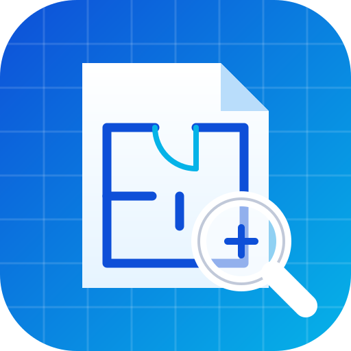

# DWG Viewer

A free, open-source viewer for AutoCAD **DWG** and **DXF** drawings that runs on
**Android, iPhone/iPad, Windows, macOS, Linux and the web** from one code base.
Everything happens on your device — drawings are never uploaded.



## Download

All builds are produced by GitHub Actions and published to the
[`dwg-viewer-latest` release](../../releases/tag/dwg-viewer-latest):

| Platform | File | Install |
|---|---|---|
| Android 5.1+ | `DWG-Viewer.apk` | Open it on the phone, allow *Install unknown apps*, tap **Install** |
| Windows 10/11 | `DWG-Viewer-Setup-Windows.exe` or `DWG-Viewer-Portable-Windows.exe` | Run it; on a SmartScreen warning choose *More info → Run anyway* (the build is not code-signed) |
| macOS 11+ | `DWG-Viewer-macOS.dmg` | Drag to Applications; first launch: right-click → **Open** (not notarised) |
| Linux | `DWG-Viewer-Linux.AppImage` / `.deb` | `chmod +x DWG-Viewer-Linux.AppImage && ./DWG-Viewer-Linux.AppImage` |
| iPhone / iPad | `DWG-Viewer-iOS-unsigned.ipa` | Sideload with AltStore or Sideloadly using your Apple ID, **or** open the web app in Safari → Share → *Add to Home Screen* |
| Web | `DWG-Viewer-web.zip` | Serve the folder over HTTPS (GitHub Pages deploys it automatically from `main`) |

## Features

- Opens DWG R13 → 2018+ (AC1012 – AC1032) and ASCII DXF (R12 → 2018)
- Lines, arcs, circles, ellipses, polylines (bulges, widths, tapered segments), splines (NURBS and fit-point),
  hatches (solid, gradient and pattern fills with islands), solids, 3D faces, polyface meshes, points
- Text and MTEXT (alignment, wrapping, rotation, inline colours/heights, special characters, Unicode),
  attributes, dimensions (incl. arc dimensions), leaders and multileaders, tables, multilines, wipeouts
- Blocks: nested, mirrored, scaled, MINSERT arrays, BYBLOCK/BYLAYER colours, linetypes and lineweights
- Model space and paper-space layouts with viewports
- Layers panel (on/off, frozen layers), layout tabs, zoom/pan/pinch, zoom extents
- Measure distance, length/area/perimeter, angle and coordinates with endpoint/midpoint/centre snapping
- Markups (pen, arrow, box, revision cloud, text notes) saved per drawing
- Text search, drawing information, black/white/grey background
- Export the view or the whole sheet to PNG or PDF; recent files reopen offline
- "Open with DWG Viewer" from file managers, mail and chat apps (Android, iOS, desktop file associations)

Not shown: ACIS 3D solids/regions, OLE objects, raster images (only their frame) and external references.

## How it works

| Part | Files |
|---|---|
| DWG decoding | [LibreDWG](https://www.gnu.org/software/libredwg/) compiled to WebAssembly via [`@mlightcad/libredwg-web`](https://github.com/mlightcad/libredwg-web) |
| DXF parsing | [`@mlightcad/dxf-json`](https://github.com/mlight-lee/dxf-json) |
| Normalisation of both formats | `src/core/normalize.js`, `src/core/load.js` |
| Geometry engine (blocks, OCS, curves, hatching, text) | `src/core/builder.js`, `src/core/geom.js`, `src/core/text.js` |
| Canvas renderer | `src/app/renderer.js` (batched Path2D, culling, linetypes, text layout) |
| App UI | `src/index.html`, `src/app.css`, `src/app/main.js` |
| Desktop shell | `electron/` (Electron + electron-builder) |
| Mobile shells | `android/`, `ios/` (Capacitor) |

Parsing runs in a Web Worker so the UI stays responsive.

## Development

```bash
npm ci
npm test                 # geometry/text unit tests + every sample drawing
npm run build            # bundles the app into www/
npm run serve            # http://localhost:8080
npm run test:ui          # Playwright UI tests (screenshots in test/screens)
node test/ui-interact.mjs test/screens
npm start                # desktop app (Electron)
npm run dist:win|mac|linux
npm run cap:sync && (cd android && ./gradlew assembleRelease)
```

`scripts/make-sample.py` (needs `pip install ezdxf`) regenerates the demo drawing, and
`node test/compare-formats.mjs a.dwg a.dxf` checks that a DWG and its DXF export render identically.

### Android signing

CI signs the APK with `android/app/ci-fallback.keystore` so updates install over each other.
For a private key, add the repository secrets `DWGV_KEYSTORE_BASE64` (base64 of a keystore with alias `dwgviewer`)
and `DWGV_KEYSTORE_PASSWORD`.

## Licence

GPL-3.0-or-later (required by LibreDWG). DWG Viewer is an independent project and is not affiliated with
Autodesk, Inc. or any other CAD vendor. AutoCAD and DWG are trademarks of Autodesk, Inc.
